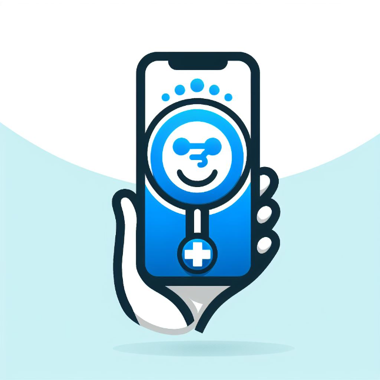
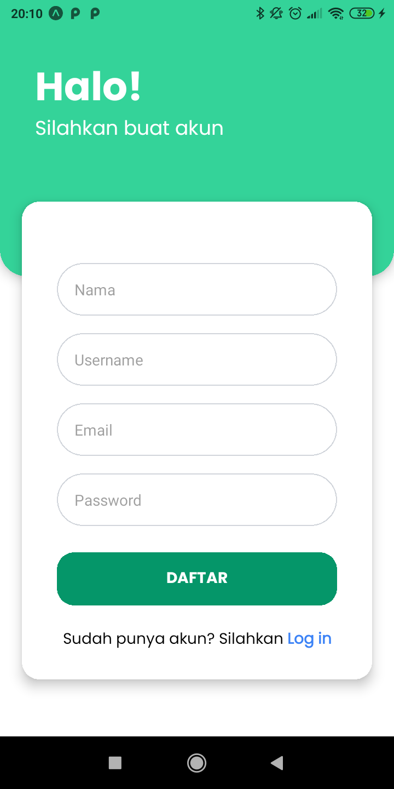
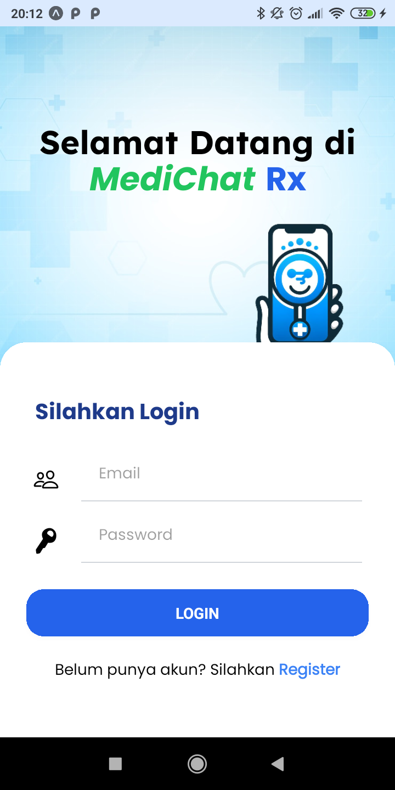
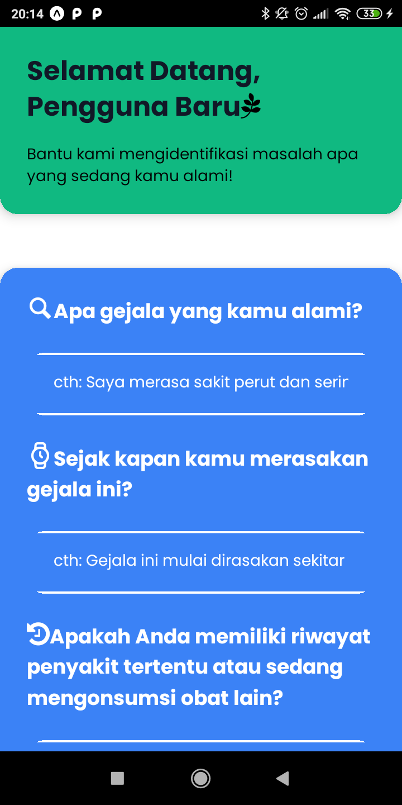
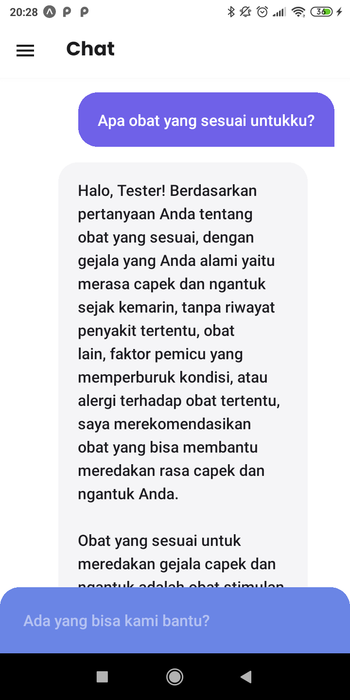
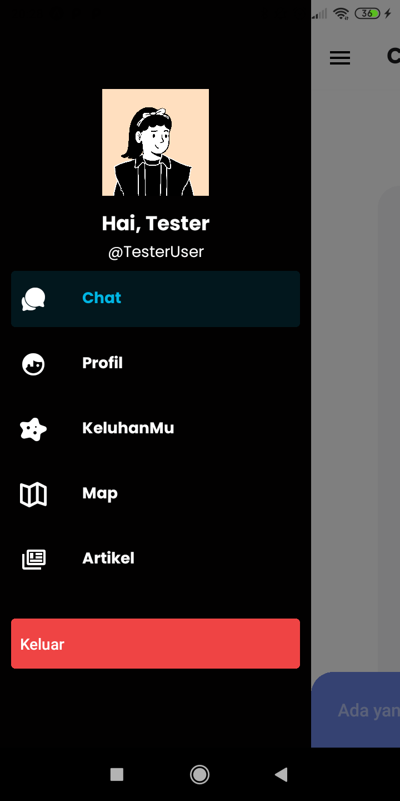
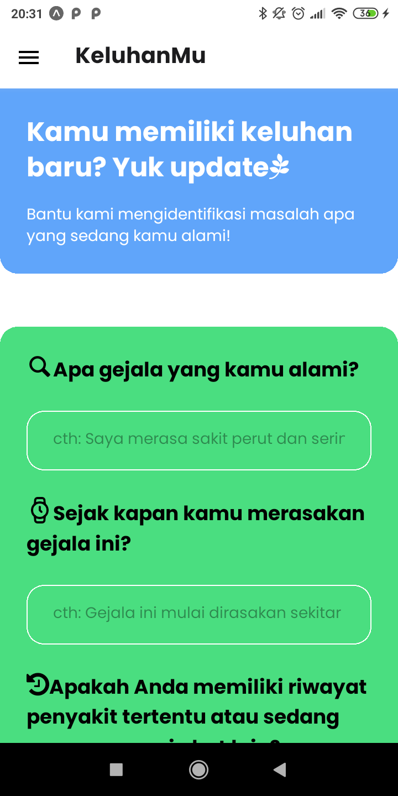
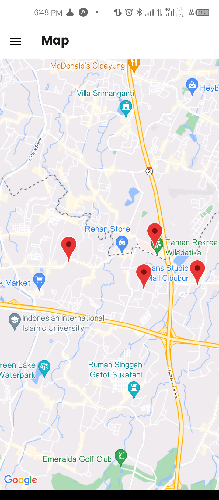

# MediChat Rx (Frontend Side)

    

## Description

MediChat Rx is a chat-based AI application where users can share their health issues or illnesses. The app provides real-time chat features to describe their symptoms and conditions, and then offers recommendations and comprehensive information about suitable medications, including prices and locations for purchase (if available at nearby pharmacies). It also suggests online shopping alternatives (with provided links) (Optional). Additionally, the app can answer medical questions and provide relevant advice and recommendations based on the information provided.
More info you can check it here: https://www.linkedin.com/pulse/medichatrx-tanya-keluhanmu-disini-carlos-hakim-34yjc/?trackingId=b2ldhIfPQ%2B%2BApmJHpwurdw%3D%3D

## MVP

1. Users can share their health issues or illnesses.
2. The app provides real-time chat features to describe their symptoms and conditions.
3. Offers recommendations and comprehensive information about suitable medications, including prices and locations for purchase.
4. The app can answer medical questions and provide relevant advice and recommendations based on the information provided.
5. Expo location (optional) (can know where the user is located → if the disease needs to go to the doctor (search from google maps for the nearest hospital from the user's position) → If the referral buys medicine, the nearest pharmacy recommendation from the user) → After getting the position of the hospital / pharmacy can be displayed using mapview.
6. The App can generate content about healthy tips based on user's complaint

## How to Use

Here are the steps to use this application:

1. Clone this repository.
2. Run `npm install` to install all necessary dependencies.
3. Create a `.env` file and fill it with the appropriate environment variables.
4. Run `npm start` to start the client.

Or if you want to try the demo app:
1. Install Expo Go on android or Ios
2. Scan this on your phone

    

## Contribution

Contributions, issues, and feature requests are very welcome. Please check issues if you want to contribute.

## License

MIT

## Screenshots

Here are some screenshots of the application:

<h2>Register</h2>

    

<h2>Login</h2>

    

<h2>User Complaint Form (For New User)</h2>

    

<h2>Chat with AI</h2>

    

<h2>Sidebar</h2>

    

<h2>AI Generated Article Based on current User Complaints</h2>

    

    

<h2>Update Complaint</h2>

    

<h2>Map (it can recommend nearby pharmacies, clinics, or hospitals)</h2>

    

